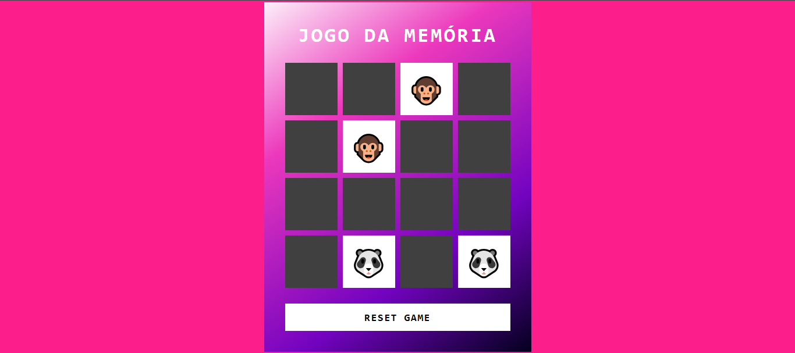

<h1>Jogo da Memória</h1>

O projeto é o "<b>Jogo da Memória</b>", bem simples... o projeto foi realizado usando <b>HTML, CSS e Javascrpt</b>.

<h1>Tecnologias usadas</h1>
<ul>
    <li><h3>HTML</h3></li>
    <li><h3>CSS</h3></li>
    <li><h3>Javascript</h3></li>
</ul>

<h1>Mais sobre o projeto</h1>

O projeto foi realizado pela <a href="https://github.com/digitalinnovationone" target="_blank">DIO</a> e acompanhei etapa por etapa para o desenvolvimento do projeto.
